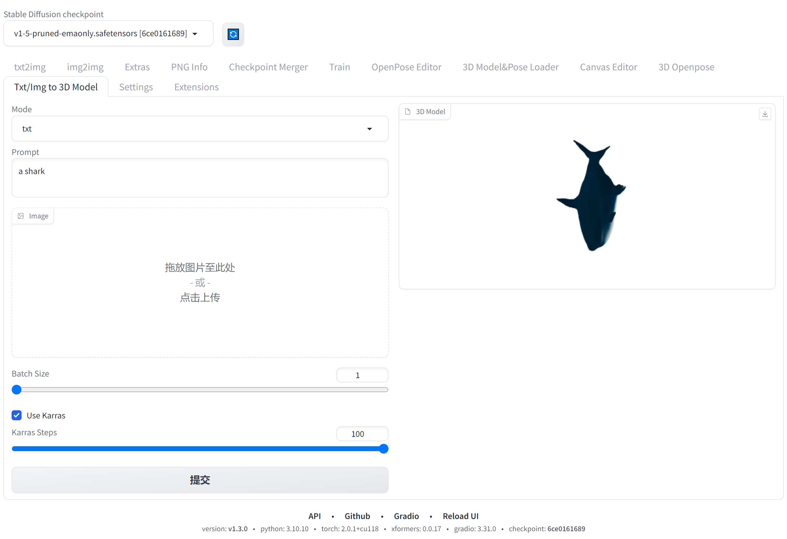

# Stable Diffusion WebUI Txt/Img To 3D Model
A custom extension for [AUTOMATIC1111/stable-diffusion-webui](https://github.com/AUTOMATIC1111/stable-diffusion-webui) that allow you to generate 3D model from txt or image, basing on [OpenAI Shap-E](https://github.com/openai/shap-e).  

## Installation
Just like you install other extension of webui:
1. go to Extensions -> Install from URL
2. paste this repo link
3. install
4. go to Installed, apply and restart UI

## About Shap-E
please go to [OpenAI Shap-E](https://github.com/openai/shap-e) to check more details.

## How to use
1. choose Mode first, txt or img.
2. for the first time, Shap-E will download its models on backend, please check the progress from console.
3. if select txt, you can type prompt then generate (no need to upload image, it would not work).
4. if select img, you can upload image then generate (no need to type prompt, it would not work).
5. for better performance, you need to remove background from your image.
6. the preview will show the latest generated one if batch size > 1, you can go to \extensions\sd-webui-txt-img-to-3d-model\outputs to check whole generated files.

## Credits
Created by [jtydhr88](https://github.com/jtydhr88), basing on [OpenAI Shap-E](https://github.com/openai/shap-e).

## My other extensions for stable diffusion webui
- [3D Model/pose loader](https://github.com/jtydhr88/sd-3dmodel-loader) A custom extension for sd-webui that allows you to load your local 3D model/animation inside webui, or edit pose as well, then send screenshot to txt2img or img2img as your ControlNet's reference image.
- [Canvas Editor](https://github.com/jtydhr88/sd-canvas-editor) A custom extension for sd-webui that integrated a full capability canvas editor which you can use layer, text, image, elements and so on, then send to ControlNet, basing on Polotno.
- [StableStudio Adapter](https://github.com/jtydhr88/sd-webui-StableStudio) A custom extension for sd-webui to extend rest APIs to do some local operations, using in StableStudio.

